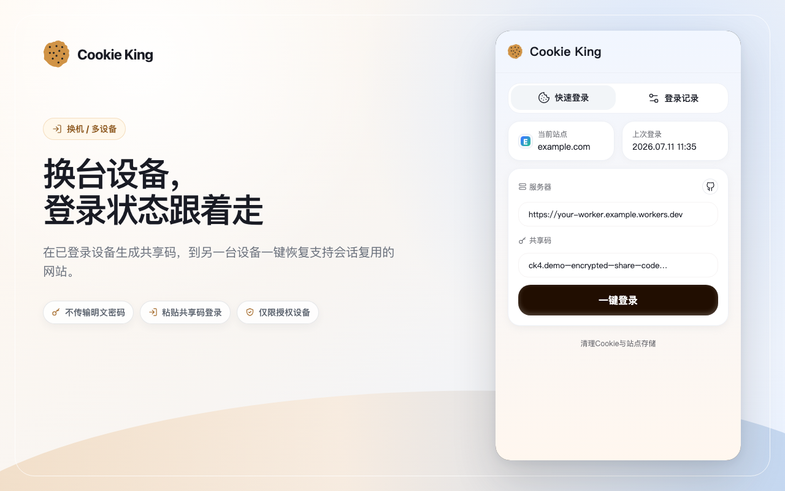

# Cookie King（中文文档）

把已经登录好的网站会话，从一个你授权的浏览器或设备，快速迁移到另一个你授权的浏览器或设备。少一次扫码，少一次短信验证，少一次从头整理环境。

[](https://chromewebstore.google.com/detail/cookie-king/cmiimifgcfadhmmhbombapaoohjnlmca)
[](worker/README.md)
[](docs/chrome-store/privacy-policy-cn.md)

> 只适用于你有权限使用的账号与设备。不要把它用于未授权账号、公开共享或绕过目标网站安全策略。

## 产品预览



## 它解决什么问题

- 新电脑、备用浏览器、临时环境接手工作时，不想重新登录一遍所有网站。
- 某些平台反复要求扫码、短信验证、二次确认，登录成本很高。
- 同一套工作环境需要在多个授权设备之间快速恢复，不想重复配置 Cookie、Storage 和站点状态。

## 为什么值得用

- 省时间：把已经可用的登录状态直接迁移过去，而不是重新闯一遍登录流程。
- 更稳：可按站点选择只同步 Cookie，或同步 Cookie 与站点存储数据。
- 可控：后端由你自己部署，云端保存的是加密密文，不依赖公共共享服务器。

## 适合的场景

- 主浏览器已经登录，想把状态迁移到备用浏览器或新设备。
- 运营、测试、客服等工作流里，需要在授权设备之间快速恢复站点环境。
- 需要把一个已经可用的登录状态迁移到独立调试环境，减少重复验证。

## 它怎么工作

1. 在已登录页面采集当前站点的 Cookie，并按同步范围决定是否采集 Storage。
2. 在浏览器本地使用 `ck4` 共享码中的独立密钥完成加密，再上传到你自己的 Worker 后端；该密钥不会发送给后端。
3. 另一端通过共享码拉取密文快照并恢复登录状态。

云端可以看到站点标识、时间戳、频道标识和访问凭证，但看不到 Cookie/Storage 明文，也无法取得 `ck4` 中仅由两端持有的加密密钥。自动验证结果与诊断历史仅保存在本机。

## 插件交互说明

- 默认打开的是 **快速登录** 页。在目标网站页面填写 Worker 服务器地址和完整 `ck4` 共享码，然后点击 **一键登录**；旧 `ck3` 仅用于读取历史快照。
- 点击左上角 Cookie King Logo 可进入 **Management / 管理端**。
- 在 **Management > Push / 推送设置** 中填写 Worker 服务器地址，点击 **随机生成** 创建共享码，选择同步范围后点击 **一键推送**。
- 在 **Management > Pushed / 推送记录** 中可以查看已推送站点、复制共享码、删除单站点云端记录、清空当前共享码全部云端记录，或设置自动推送。
- 在 **登录记录** 中可以查看已登录网站，并设置自动拉取；同一网站的相关子域合并显示。
- 接收后会自动对比恢复前后的登录页面与会话信号：检测到登录成功时不打扰，检测到失败时直接展示原因和建议。
- Cookie/Storage 部分写入失败会自动回滚；站点无法通用验证且没有明确失败证据时，界面保持安静。
- 登录页位于相关子域时，父域 Cookie 可直接恢复；host-only Cookie 会写回快照源站，并由后台导航到源站完成登录跳转。localStorage/sessionStorage 不跨 Origin 写入。
- 服务器字段旁边的 GitHub 图标会打开项目主页，项目主页内包含后端部署说明。
- 鼠标悬停或键盘聚焦图标按钮时，会显示该按钮的作用提示。

## 同步范围

- `Cookie`：只迁移 Cookie 登录态，适合跨地区家人共享等更保守的场景。
- `Cookie+Storage`：同步 Cookie、localStorage、sessionStorage，成功率通常更高，仍是默认模式。

## 获取方式

Chrome 应用商店正式地址：[Cookie King](https://chromewebstore.google.com/detail/cookie-king/cmiimifgcfadhmmhbombapaoohjnlmca)

## 后端部署

当前后端使用 Durable Object 保证索引和限流的一致性，因此正式支持 Wrangler CLI 部署；只复制 Worker 源码到网页编辑器不会创建所需迁移。
示例 Worker 支持最大 20 MiB 的加密快照；如仍收到 `Payload too large`，请先更新并重新部署 Worker。

### Wrangler CLI 部署

```bash
cd worker
npm install
npx wrangler login
# 在 worker/wrangler.toml 填入你自己的 KV id；Durable Object 由配置自动创建
npm test
npm run deploy
```

更完整的部署说明见 [worker/README.md](worker/README.md)。

## 使用流程

1. 部署好 Worker，并拿到自己的 `workers.dev` 地址。
2. 在插件里填写 `Server URL`。
3. 在推送端点击“随机生成共享码”，再执行“一键推送”。
4. 在接收端填写同一个共享码，执行“一键登录”。

## 当前接口

当前正式接口只提供 `V3`：

- `GET /api/health`
- `POST /api/v3/owners/bootstrap`
- `POST /api/v3/channels`
- `GET /api/v3/owners/sites`
- `DELETE /api/v3/owners/sites`
- `GET /api/v3/channels/:channelId/sites`
- `GET | PUT | DELETE /api/v3/channels/:channelId/sites/:siteId`
- `DELETE /api/v3/channels/:channelId`

## 兼容关系

- Extension `0.1.x` -> Worker API `V3`

## 安全说明

- 会话快照在浏览器端加密后再上传。
- 拉取需要 `read token`。
- 推送和删除需要 `owner` 凭证与 `write token`。
- 删除云端记录不会保证目标网站立刻让已登录设备掉线，这取决于网站自身的会话策略。
